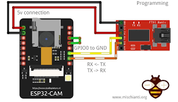

# Real-World Aim Assist

Object Detection using Haar Cascade Classifier

## Introduction

The aim of this project is to build a prototype of a real-world gun aim assist using object detection and audio signals.

OpenCV supports a variety of machine learning algorithms and while deep neural networks have received a lot of attention lately, **Haar Cascade Classifiers** remain a valid choice when dealing with object detection.

The reason for this is that Cascade Classifiers represent a compromise between *speed* and *robustness*:

1. they are computationally efficient and can process images in real-time or near real-time, even on resource-constrained devices
2. they have been proven to work well in a variety of real-world scenarios and lighting conditions

The training of a Cascade Classifier involves many steps starting from the creation of the data set.

## Cascade Classifier Training

In order to train a Cascade Classifier we need first and foremost:

1. a set of **negative samples** (containing everything you do not want to detect)
2. a set of **positive samples** (containing actual objects you want to detect)

### Negative Samples

Negative samples are images of environments not containing the object we want to detect, but where the object is likely to be found. For this reason, Negative Samples are also called Background Samples or Background Images.

These negative images should then be listed in a special **Negative Description File** file whose structure is shown below:

To build it we use the **negDesFileGenerator()** function in fileGeneration.py.

### Positive Samples

Positive Samples are images containing the object you want to detect.

Once the positive images are collected we must proceed with the creation of the **Positive Description File** which contains the following information for each line:

1. the image path
2. the number of occurrences of the object in that image
3. the coordinates of the object's bounding rectangle (x, y, width, height)

To build it we use the OpenCV's integrated annotation tool: **opencv_annotation**.

### .xml file creation

The next thing we need to do is creating a **pos.vec** file from our pos.txt file.
To do that we use the **opencv_createsamples** application.
Look at "create samples output.png".

The **cascade.xml** file in the cascade folder is the actual trained model.
To create that file we use OpenCV's integrated **opencv_createsamples** application taking as input pos.vec and neg.txt.

# ESP 32 cam

To achieve the goal of object detecting we use the **ESP32-CAM**, which is a  microcontroller from Espressif that  has an integrated video camera with the ability of live streaming once a wireless connection is established between the ESP 32 and our device. 

In order to work with the ESP32-CAM we need an external **FTDI** adapter that allows us to connect the camera to our PC via USB.

To connect the FTDI adapter to the ESP32-CAM we followed a specific module that showed us which **GPIO pins** we had to link. 

This is the module: 

To interactively control the ESP32-CAM we use the **ARDUINO IDE**, downloaded at this link:

https://support.arduino.cc/hc/en-us/articles/360019833020-Download-and-install-Arduino-IDE

Once the download is completed, inside the ARDUINO IDE we had to install specific **Boards** for ESP32 (collection of files needed to compile and upload sketches for a board) using this JSON link in the Board Manager:

https://dl.espressif.com/dl/package_esp32_index.json

This will allow us to find a list of boards of ESP32, from where we select the **A-THINKER ESP32-CAM** board.

The next step is to load the **Sample Sketch**, provided by the ARDUINO IDE, under the name of **CameraWebServer**. 

You can load it by:

* Open the Arduino IDE
* Click on the File menu item on the top menu bar
* Scroll down and click on Examples. A sub-menu will open
* Scroll down the sub-menu and look for Examples for A-Thinker ESP32-CAM
* Below this you’ll see an entry for ESP32. Click on it and another sub-menu will open
* Select Camera from this sub-menu
* Select CameraWebServer

This sketch allows you to interact with the camera by changing the settings on the code.
For our project we will change the sketch by selecting the right Camera Model that we need for our board, which is: 

**CAMERA_MODEL_AI_THINKER**

We can comment on all the other models that are listed.

Below this line of code, you see:

* A line for your  SSID
* A line for your  network access password

This is a **very important step** for the configuration of our ESP32-CAM since the live-streaming will be based on your wifi connection, so the wifi connection of the PC and of the ESP32 must be the same, otherwise your ESP32 won’t work.

Then we select the PC port where the USB cable of the FTDI is connected.

Once this is done we can upload the sketch and wait for it to compile.

The next step is to **obtain the IP address** of the ESP32-CAM. This allows us to see the live streaming.

In order to get the IP address we open the **Serial Monitor** and set it to a baud rate of 115,200 bps. By pressing the Reset switch located on the Camera module we will be able to see the IP Address of the camera in the form of a URL; this means that the board has connected to the network. 

Then we copy this address on the web browser where we will be able to see the webpage of the camera; through this webpage, we can change the settings of the ESP32.

In order to start the live streaming you have to click on the **Start Stream** button.

For our project in order to perform object detection, we have to catch the ESP32-CAM live frame of the streaming by using open-cv function: **Cv2.videocapture**.

	
